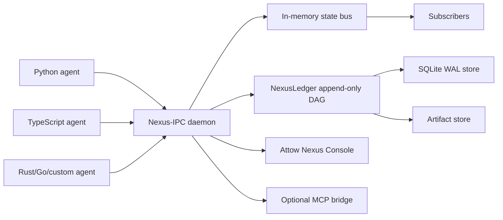

# Attow Nexus

[](https://github.com/sharb1235-hash/attow-nexus/actions/workflows/ci.yml)
[](https://github.com/sharb1235-hash/attow-nexus/actions/workflows/security.yml)
[](LICENSE)

**Git for AI agent state.**

**A local coordination daemon and Git-like state ledger for polyglot AI agents.**

Built by Attow, Inc. as part of a local-first AI infrastructure stack.

One local daemon, one ledger, one CLI, three framework surfaces feeding the same run.

Not another agent framework - the shared state and debugging substrate underneath them.

Nexus-IPC is a local coordination daemon for polyglot AI agents. NexusLedger is the Git-like state history built on top of it. Attow Nexus Console is the live debugger and dashboard. Together, they let agents share state in real time while giving developers replay, rollback, diffing, loop detection, and debugging for every important state transition.

## 60-Second Quickstart

Get the Attow Nexus local daemon, universal demo, and dashboard running with two terminals.

Terminal 1 - keep this running:

```powershell
cd <repo>
docker compose up --build
```

Terminal 2 on Windows PowerShell:

```powershell
cd <repo>
.\scripts\setup.ps1
```

If your PowerShell execution policy blocks local scripts, run:

```powershell
powershell -NoProfile -ExecutionPolicy Bypass -File .\scripts\setup.ps1
```

Terminal 2 on macOS/Linux:

```bash
cd <repo>
chmod +x scripts/setup.sh
./scripts/setup.sh
```

Browser:

Open the Vite Local URL printed by the setup script, usually `http://127.0.0.1:5173` or `http://127.0.0.1:5174`.

The setup script checks the API and metrics, installs the local Python SDK in editable mode, runs the no-key universal translation demo, runs the TypeScript/Vercel-style demo, prints CLI inspection output, and starts the Vite dashboard server. No cloud account or API key is required.

Docker Compose runs the daemon/API/metrics in Terminal 1. The dashboard runs separately through Vite dev mode from `dashboard/`.

Attow Nexus does not collect daemon, CLI, SDK, or local dashboard runtime telemetry in v0.1. See [PRIVACY.md](PRIVACY.md) for the local-runtime privacy boundary.

## Inspecting the Substrate Natively

These commands are not required for the quickstart. They are useful when you want to inspect the local daemon, ledger, and CLI directly.

Windows PowerShell:

```powershell
curl.exe http://127.0.0.1:7822/api/health
curl.exe http://127.0.0.1:7823/metrics
cargo run -p nexus -- status
cargo run -p nexus -- agents
cargo run -p nexus -- channels
cargo run -p nexus -- log --run universal-demo
cargo run -p nexus -- diff <commit_a> <commit_b>
cargo run -p nexus -- replay <commit_b>
```

macOS/Linux:

```bash
curl http://127.0.0.1:7822/api/health
curl http://127.0.0.1:7823/metrics
cargo run -p nexus -- status
cargo run -p nexus -- agents
cargo run -p nexus -- channels
cargo run -p nexus -- log --run universal-demo
cargo run -p nexus -- diff <commit_a> <commit_b>
cargo run -p nexus -- replay <commit_b>
```

## Broken Agent Recovery Demo

When an agent crashes at step 14, stop rerunning steps 1-13. This demo shows a local multi-agent workflow producing a bad state transition, Nexus identifying the bad commit, the developer diffing/replaying the last good state, and the workflow recovering from a fixed commit.

Git gave developers version control for code. Attow Nexus gives developers version control for agent state.

Terminal 1:

```powershell
docker compose up --build
```

Terminal 2:

```powershell
py -m pip install -e sdks\python
py examples\broken-agent-recovery\run_demo.py
```

Then inspect with the commit IDs printed by the script:

```powershell
cargo run -p nexus -- log --run broken-agent-demo
cargo run -p nexus -- diff <last_good_commit> <bad_commit>
cargo run -p nexus -- replay <final_commit>
```

The demo is deterministic and local: no LLM calls, no API keys, and no cloud services. Nexus replays captured logical state. It does not automatically undo real-world side effects such as file writes, emails, API calls, purchases, deployments, or database mutations unless an adapter provides compensating actions.

## Local Endpoints

Docker Compose starts the Attow Nexus daemon, HTTP API, and metrics endpoint. It does not currently serve the production React dashboard at `/`.

- API health: [http://127.0.0.1:7822/api/health](http://127.0.0.1:7822/api/health)
- Metrics: [http://127.0.0.1:7823/metrics](http://127.0.0.1:7823/metrics)
- Dashboard dev server: the URL printed by Vite from `dashboard/`, usually `http://127.0.0.1:5173` or `http://127.0.0.1:5174`

## What Works Today

- [x] Local daemon/API.
- [x] Metrics endpoint.
- [x] Docker Compose daemon run.
- [x] Python SDK.
- [x] TypeScript SDK.
- [x] Durable commits.
- [x] CLI `status`, `agents`, `channels`, `log`, `diff`, and `replay`.
- [x] Dashboard dev UI.
- [x] Basic commit display.
- [x] Basic metrics display.
- [x] Universal event schema.
- [x] Python/TypeScript fixture parity.
- [x] `/api/events` canonical ingestion.
- [x] Universal translation demo.
- [x] Broken Agent Recovery demo.
- [x] LangGraph wrapper with a real no-LLM example.
- [x] CrewAI-style wrapper verified with fake/public callback shape.
- [x] Vercel AI SDK-style wrapper verified with fake `generateText`/`streamText`.
- [x] Auth smoke script.
- [x] CLI smoke script.
- [x] Stress scripts.
- [x] Demo video pipeline.

## What Is Experimental

- Production dashboard bundling in Docker.
- Framework adapters are early and should use public hooks, callbacks, middleware, checkpointers, or explicit wrappers.
- Deep framework-native checkpointer/store bridges.
- MCP bridge.
- Local cluster mode.
- Windows named pipe transport.
- RocksDB store.
- OpenTelemetry.
- Encryption-at-rest.
- Production remote synchronization.
- APIs may change before v1.0.
- Security hardening is local-first/dev-first; remote use needs a deployment-specific review.
- Cloud and team features are roadmap only.

## Architecture



## Three Layers

**Nexus-IPC** is the live local coordination bus. Agents register, heartbeat, publish structured state deltas, subscribe to channels, receive broadcasts, and share captured context without coupling their framework code.

**NexusLedger** is the durable Git-like state graph. Durable deltas become content-addressed commits that can be diffed, replayed, forked, exported, and inspected.

**Attow Nexus Console** is the local dashboard. It shows connected agents, active channels, recent deltas, commit history, tool calls, loop warnings, replay output, fork controls, rollback warnings, and metrics.

## Why Attow Nexus Exists

Agent frameworks are good at orchestration inside one application. Real systems often have multiple agents, languages, runtimes, local processes, and tools. Attow Nexus provides the shared local substrate beneath agent frameworks so they can coordinate through versioned protocol messages and durable logical agent state.

## Why Not Just LangGraph Memory?

LangGraph memory and checkpointing are excellent for LangGraph applications. Attow Nexus is not trying to replace framework-native memory, persistence, or orchestration.

Attow Nexus is useful when logical agent state spans multiple frameworks, languages, runtimes, local processes, tools, or custom workers. It acts as a neutral local state bus plus Git-like ledger underneath agent frameworks, so LangGraph, CrewAI, AutoGen, Microsoft Agent Framework, custom Python workers, TypeScript services, and other processes can coordinate without all adopting the same application framework.

The intended relationship is complementary: keep using the framework-native memory that works best inside each app, and use Attow Nexus when shared structured state deltas, durable commits, cross-process observability, diffing, replay, and rollback of captured logical state need to cross framework boundaries.

## Universal Translation Layer Demo

The v0.1 developer-preview claim is simple: **one local daemon, one ledger, one CLI, three framework surfaces feeding the same run.**

Attow Nexus normalizes state events from multiple frameworks into one local bus and ledger. The current adapters are public-surface wrappers. They do not require node pollution or state schema changes, and they do not pretend to be deep framework-native stores. Deep framework-specific checkpointer/store bridges are future work.

The shared event contract is documented in [docs/protocol.md](docs/protocol.md), and the HTTP JSON surface is documented in [docs/http-api.md](docs/http-api.md). Python and TypeScript adapters are tested against the same canonical fixtures in `test-fixtures/universal-events`.

Run the local no-key demo in [examples/universal-translation-demo](examples/universal-translation-demo):

```powershell
cd <repo>
docker compose up --build
```

In another PowerShell:

```powershell
cd <repo>
cd sdks\python
py -m pip install -e .
py -m pip install langgraph
cd ..\..
py examples\universal-translation-demo\langgraph_planner.py
py examples\universal-translation-demo\crewai_researcher.py
```

In a third PowerShell:

```powershell
cd <repo>\examples\universal-translation-demo
npm.cmd install
npm.cmd run vercel-demo
```

Then inspect the shared run:

```powershell
cd <repo>
cargo run -p nexus -- agents
cargo run -p nexus -- channels
cargo run -p nexus -- log --run universal-demo
```

| Framework surface | Language | Adapter API | Verified level | Notes |
| --- | --- | --- | --- | --- |
| LangGraph | Python | `instrument_langgraph` | Verified wrapper with fake graph tests; real no-LLM example when `langgraph` is installed | No node changes |
| CrewAI | Python | `instrument_crewai` | Verified wrapper with fake crew tests; public `step_callback` composition when available | No task changes |
| Vercel AI SDK | TypeScript | `instrumentStreamText` / `instrumentGenerateText` | Verified with fake `streamText` / `generateText` | Preserves callbacks |

## LangGraph In Four Lines

```python
from nexus_ipc import NexusClient
from nexus_ipc.adapters.langgraph import instrument_langgraph

client = NexusClient.connect()
graph = instrument_langgraph(graph, client=client, run_id="my-run")

result = graph.invoke(input_state, config={"configurable": {"thread_id": "thread-1"}})
```

Your node functions do not import Nexus, and your LangGraph state schema does not change. The wrapped graph keeps its normal `.invoke()`, `.stream()`, `.ainvoke()`, and `.astream()` behavior while Attow Nexus records local durable checkpoints for graph start/end, stream updates, errors, run/thread metadata, and replayable commit ancestry.

This is public-surface wrapper instrumentation around the compiled graph API, not private monkeypatching. It complements LangGraph checkpointers rather than replacing them. See [examples/python-langgraph-one-line](examples/python-langgraph-one-line) for a real no-LLM LangGraph example.

## Install

Docker daemon/API and metrics:

```bash
docker compose up --build
```

Docker exposes the HTTP API at `http://127.0.0.1:7822` and metrics at `http://127.0.0.1:7823`. The React dashboard is run separately from `dashboard/` during development.

The Docker Compose demo binds the daemon to `0.0.0.0` inside the container with auth disabled for local development, but publishes host ports only on `127.0.0.1`. Do not change those host port bindings to public interfaces without enabling auth and reviewing the security model.

Cargo:

```bash
cargo install --path daemon --bin nexusd
cargo install --path cli --bin nexus
```

Python:

```bash
py -m pip install nexus-ipc
```

TypeScript:

```bash
npm install @nexus-ipc/sdk
```

### One-Line Setup Script

The clone-based setup above is the primary quickstart. If you prefer a shell setup script on macOS/Linux, review the script first and then run it directly from GitHub:

```bash
curl -fsSL https://raw.githubusercontent.com/sharb1235-hash/attow-nexus/main/scripts/setup.sh | bash
```

On Windows, prefer the clone-based `.\scripts\setup.ps1` flow rather than remote PowerShell execution.

## Python Example

```python
from nexus_ipc import NexusClient

client = NexusClient.connect()
client.register_agent(
    agent_id="researcher",
    run_id="run-123",
    capabilities=["web_research", "summarization"],
    framework="custom",
)

commit = client.checkpoint(
    agent_id="researcher",
    run_id="run-123",
    channel="topic:research_findings",
    state={"claim": "Revenue increased 12 percent", "confidence": 0.91},
    summary="Added revenue finding",
    tags=["research", "finance"],
)
print(commit.commit_id)
```

## TypeScript Example

```ts
import { NexusClient } from "@nexus-ipc/sdk";

const client = await NexusClient.connect();
await client.registerAgent({
  agentId: "writer",
  runId: "run-123",
  capabilities: ["drafting", "summarization"],
  framework: "custom",
});

const commit = await client.checkpoint({
  agentId: "writer",
  runId: "run-123",
  channel: "topic:draft",
  state: { section: "intro", done: true },
  summary: "Finished intro draft",
});
console.log(commit.commitId);
```

## Dashboard


The console is a Vite/React app in `dashboard/`. During development on Windows PowerShell:

```powershell
cd dashboard
npm.cmd install
npm.cmd run dev
```

Open the URL printed by Vite. If port 5173 is already in use, Vite may choose another port such as 5174.

## Demo Assets

The captured local product demo is [docs/assets/nexus-demo.mp4](docs/assets/nexus-demo.mp4). A GIF version is also available at [docs/assets/nexus-demo.gif](docs/assets/nexus-demo.gif).

The polished 60-second Remotion product intro video is [docs/assets/attow-nexus-launch.mp4](docs/assets/attow-nexus-launch.mp4), with source in [scripts/remotion-launch-video](scripts/remotion-launch-video/README.md).

Regenerate the captured product demo locally with the repeatable script in [scripts/demo](scripts/demo/README.md):

```powershell
cd <repo>
cd scripts\demo
npm.cmd install
npx.cmd playwright install chromium
cd ..\..
npm.cmd --prefix scripts/demo run demo
```

The script requires the Docker daemon to already be running. It checks `/api/health`, captures real CLI and metrics output, starts the Vite dashboard dev server if needed, captures dashboard screenshots, and uses FFmpeg to write `docs/assets/nexus-demo.mp4`.

## Security Model

Attow Nexus binds locally by default. TCP mode requires bearer token authentication unless `NEXUS_REQUIRE_AUTH=false` is explicitly set for local development. SDKs and the daemon redact secrets before payloads are sent, broadcast, or persisted. UDS permissions are restricted to the current user on Unix-like systems.

Remote binding requires `NEXUS_ALLOW_REMOTE=true` and should be paired with token management, network controls, and a deployment-specific security review.

Privacy details are documented in [PRIVACY.md](PRIVACY.md). The local runtime remains no-cloud and no-API-key by default.

## Rollback Limitations

Rollback moves NexusLedger head pointers for captured logical state. It does not reverse external side effects. Emails, database writes, API calls, transactions, messages, file writes, deployments, purchases, and similar actions are logged as irreversible unless an adapter provides a compensating action.

## Framework Integrations

Attow Nexus integrates through public hooks, callbacks, middleware, checkpointers, and explicit wrappers. The Python SDK includes generic, LangGraph, CrewAI, AutoGen, and Microsoft Agent Framework wrapper helpers. The TypeScript SDK includes generic, LangGraph JS, AutoGen-style, and Vercel AI SDK wrapper helpers.

The framework-specific helpers are not verified deep integrations with pinned framework packages yet. They are designed as explicit public-boundary wrappers that complement framework-native persistence instead of replacing it. See [docs/adapters.md](docs/adapters.md).

The LangGraph Python adapter now includes `instrument_langgraph`, a compiled-graph proxy that captures invoke/stream boundaries without changing node code. Node-level detail depends on what LangGraph exposes through public stream/callback events.

## MCP Bridge

The MCP bridge is experimental. Current code describes the tool/resource surface and local configuration; a full MCP host runtime handshake is not yet verified in CI. Set `NEXUS_MCP_ENABLED=true` only for local experiments.

Planned local-only tools and resources include:

- `nexus_list_runs`
- `nexus_list_agents`
- `nexus_list_channels`
- `nexus_get_commit`
- `nexus_diff_commits`
- `nexus_replay_state`
- `nexus_fork_run`
- `nexus_search_commits`
- `nexus_get_channel_snapshot`

## Benchmarks

Run local benchmarks on your machine before publishing numbers:

```bash
nexus bench local --events 10000 --payload-size 4096
```

The benchmark reports p50/p95/p99 publish latency, durable checkpoint latency sampling, throughput, artifact throughput guidance, and memory usage pointers. The README intentionally avoids fixed latency claims until numbers are generated locally.

## Demo Flow

1. Three framework surfaces publish to one local run.
2. NexusLedger records durable commits with explicit parent links.
3. A broken agent transition records invalid captured logical state.
4. The developer diffs the bad commit against the last good commit.
5. The developer replays the last good state.
6. The workflow resumes from a recovery commit.
7. Attow Nexus Console shows the local daemon, channels, commits, and metrics through Vite dev mode.

## Roadmap

Attow Nexus is local-first developer infrastructure. Near-term roadmap work focuses on SDK ergonomics, public wrapper adapters, replay/diff UX, dashboard polish, storage and observability hardening, local trusted-machine coordination, and clearer docs for safe use with captured logical state. See [ROADMAP.md](ROADMAP.md).

## Contributing

See [CONTRIBUTING.md](CONTRIBUTING.md). Protobuf schemas are governed by Buf; field numbers must never be reused, and deleted fields or enum values must be reserved.

## License

Apache-2.0. See [LICENSE](LICENSE) and [NOTICE](NOTICE).
