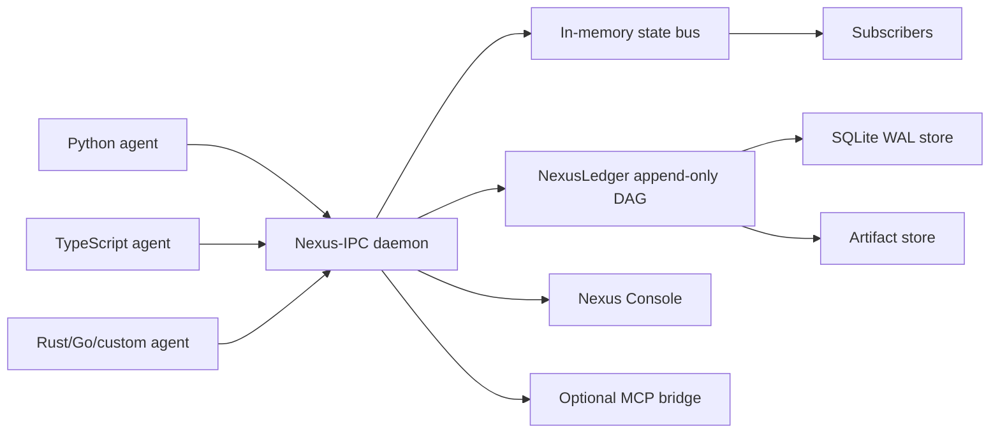
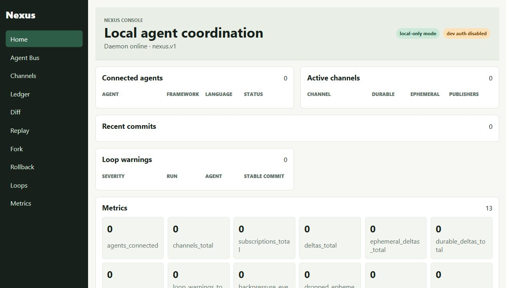

# Nexus

[](https://github.com/nexus-ipc/nexus/actions/workflows/ci.yml)
[](https://github.com/nexus-ipc/nexus/actions/workflows/security.yml)
[](LICENSE)

**A local coordination daemon and Git-like state ledger for polyglot AI agents.**

Not another agent framework — the shared state substrate underneath them.

Nexus-IPC is a local coordination daemon for polyglot AI agents. NexusLedger is the Git-like state history built on top of it. Nexus Console is the live debugger and dashboard. Together, they let agents share state in real time while giving developers replay, rollback, diffing, loop detection, and debugging for every important state transition.

## 60-Second Quickstart

```bash
git clone https://github.com/nexus-ipc/nexus.git
cd nexus
cargo build --workspace
NEXUS_REQUIRE_AUTH=false cargo run -p nexus -- daemon start
```

In another terminal:

```bash
cd sdks/python
pip install -e .
cd ../../
python examples/python-basic/main.py
```

Then inspect the run:

```bash
nexus agents
nexus channels
nexus log --run demo-run
nexus replay <commit_id>
nexus diff <commit_a> <commit_b>
```

Open Nexus Console at [http://127.0.0.1:7822](http://127.0.0.1:7822) when running with the local HTTP API.

## Architecture



## Three Layers

**Nexus-IPC** is the live local coordination bus. Agents register, heartbeat, publish structured state deltas, subscribe to channels, receive broadcasts, and share captured context without coupling their framework code.

**NexusLedger** is the durable Git-like state graph. Durable deltas become content-addressed commits that can be diffed, replayed, forked, exported, and inspected.

**Nexus Console** is the local dashboard. It shows connected agents, active channels, recent deltas, commit history, tool calls, loop warnings, replay output, fork controls, rollback warnings, and metrics.

## Why Nexus Exists

Agent frameworks are good at orchestration inside one application. Real systems often have multiple agents, languages, runtimes, and tools. Nexus provides the shared local substrate beneath agent frameworks so they can coordinate through versioned protocol messages and durable logical agent state.

## Install

Docker:

```bash
docker compose up --build
```

Cargo:

```bash
cargo install --path daemon --bin nexusd
cargo install --path cli --bin nexus
```

Python:

```bash
pip install nexus-ipc
```

TypeScript:

```bash
npm install @nexus-ipc/sdk
```

## Python Example

```python
from nexus_ipc import NexusClient

client = NexusClient.connect()
client.register_agent(
    agent_id="researcher",
    run_id="run-123",
    capabilities=["web_research", "summarization"],
    framework="custom",
)

commit = client.checkpoint(
    agent_id="researcher",
    run_id="run-123",
    channel="topic:research_findings",
    state={"claim": "Revenue increased 12 percent", "confidence": 0.91},
    summary="Added revenue finding",
    tags=["research", "finance"],
)
print(commit.commit_id)
```

## TypeScript Example

```ts
import { NexusClient } from "@nexus-ipc/sdk";

const client = await NexusClient.connect();
await client.registerAgent({
  agentId: "writer",
  runId: "run-123",
  capabilities: ["drafting", "summarization"],
  framework: "custom",
});

const commit = await client.checkpoint({
  agentId: "writer",
  runId: "run-123",
  channel: "topic:draft",
  state: { section: "intro", done: true },
  summary: "Finished intro draft",
});
console.log(commit.commitId);
```

## Dashboard



The console is a Vite/React app in `dashboard/`. During development:

```bash
cd dashboard
npm install
npm run dev
```

## Security Model

Nexus binds locally by default. TCP mode requires bearer token authentication unless `NEXUS_REQUIRE_AUTH=false` is explicitly set for local development. SDKs and the daemon redact secrets before payloads are sent, broadcast, or persisted. UDS permissions are restricted to the current user on Unix-like systems.

Remote binding requires `NEXUS_ALLOW_REMOTE=true` and should be paired with token management, network controls, and a deployment-specific security review.

## Rollback Limitations

Rollback moves NexusLedger head pointers for captured logical state. It does not reverse external side effects. Emails, database writes, API calls, transactions, messages, file writes, deployments, purchases, and similar actions are logged as irreversible unless an adapter provides a compensating action.

## Framework Integrations

Nexus integrates through public hooks, callbacks, middleware, checkpointers, and explicit wrappers. The Python SDK includes generic, LangGraph, CrewAI, AutoGen, and Microsoft Agent Framework helpers. The TypeScript SDK includes generic, LangGraph JS, and AutoGen-style helpers.

## MCP Bridge

Set `NEXUS_MCP_ENABLED=true` to expose local-only MCP tools and resources:

- `nexus_list_runs`
- `nexus_list_agents`
- `nexus_list_channels`
- `nexus_get_commit`
- `nexus_diff_commits`
- `nexus_replay_state`
- `nexus_fork_run`
- `nexus_search_commits`
- `nexus_get_channel_snapshot`

## Benchmarks

Run local benchmarks on your machine before publishing numbers:

```bash
nexus bench local --events 10000 --payload-size 4096
```

The benchmark reports p50/p95/p99 publish latency, durable checkpoint latency sampling, throughput, artifact throughput guidance, and memory usage pointers. The README intentionally avoids fixed latency claims until numbers are generated locally.

## Demo Story

1. Agent A publishes a plan.
2. Agent B receives the plan through Nexus-IPC.
3. Agent B publishes research.
4. Agent C receives research and drafts output.
5. NexusLedger records durable commits.
6. Nexus Console shows the live Agent Bus.
7. A repeated tool failure triggers a loop warning.
8. A developer diffs the bad commit against the last stable commit.
9. A developer forks from the stable commit and resumes from corrected state.

## Cloud Roadmap

The open-source project is local-first. Future paid offerings may include hosted dashboards, team workspaces, cloud sync, long-term retention, RBAC, SSO/SAML, audit exports, production alerting, incident replay, enterprise support, private deployment, and SOC2-oriented logs.

## Contributing

See [CONTRIBUTING.md](CONTRIBUTING.md). Protobuf schemas are governed by Buf; field numbers must never be reused, and deleted fields or enum values must be reserved.

## License

Apache-2.0. See [LICENSE](LICENSE).
