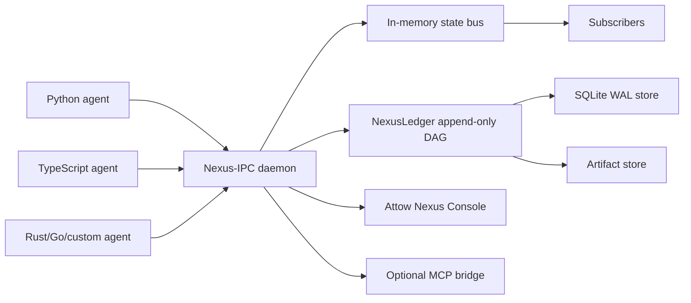

# Attow Nexus

[](https://github.com/sharb1235-hash/attow-nexus/actions/workflows/ci.yml)
[](https://github.com/sharb1235-hash/attow-nexus/actions/workflows/security.yml)
[](LICENSE)

**Git for AI agent state.**

**A local coordination daemon and Git-like state ledger for polyglot AI agents.**

Built by Attow as part of a local-first AI infrastructure stack.

Not another agent framework - the shared state substrate underneath them.

Nexus-IPC is a local coordination daemon for polyglot AI agents. NexusLedger is the Git-like state history built on top of it. Attow Nexus Console is the live debugger and dashboard. Together, they let agents share state in real time while giving developers replay, rollback, diffing, loop detection, and debugging for every important state transition.

## 60-Second Quickstart

These commands are written for Windows PowerShell. They use `curl.exe`, `py`, `py -m pip`, and `npm.cmd` to avoid common PATH and PowerShell execution-policy issues.

Terminal 1 - keep this running:

```powershell
cd <repo>
docker compose up --build
```

Terminal 2 - verify the daemon/API and run the demo:

```powershell
cd <repo>
curl.exe http://127.0.0.1:7822/api/health
curl.exe http://127.0.0.1:7823/metrics
cd sdks\python
py -m pip install -e .
cd ..\..
py examples\python-basic\main.py
cargo run -p nexus -- status
cargo run -p nexus -- agents
cargo run -p nexus -- channels
cargo run -p nexus -- log --run demo-run
```

Terminal 3 - run Attow Nexus Console in Vite dev mode:

```powershell
cd <repo>\dashboard
npm.cmd install
npm.cmd run dev
```

Browser:

Open the Vite URL printed by `npm.cmd run dev`. It is usually `http://127.0.0.1:5173` or `http://127.0.0.1:5174` if 5173 is already in use.

For macOS/Linux, the equivalent flow is:

```bash
cd <repo>
docker compose up --build
```

In another terminal:

```bash
cd <repo>
curl http://127.0.0.1:7822/api/health
curl http://127.0.0.1:7823/metrics
cd sdks/python
python3 -m pip install -e .
cd ../..
python3 examples/python-basic/main.py
cargo run -p nexus -- status
cargo run -p nexus -- agents
cargo run -p nexus -- channels
cargo run -p nexus -- log --run demo-run
```

And for the dashboard:

```bash
cd <repo>/dashboard
npm install
npm run dev
```

## Local Endpoints

Docker Compose starts the Attow Nexus daemon, HTTP API, and metrics endpoint. It does not currently serve the production React dashboard at `/`.

- API health: [http://127.0.0.1:7822/api/health](http://127.0.0.1:7822/api/health)
- Metrics: [http://127.0.0.1:7823/metrics](http://127.0.0.1:7823/metrics)
- Dashboard dev server: the URL printed by Vite from `dashboard/`, usually `http://127.0.0.1:5173` or `http://127.0.0.1:5174`

## What Works Today

- [x] Local daemon/API.
- [x] Metrics endpoint.
- [x] Docker Compose daemon run.
- [x] Python SDK editable install.
- [x] Python demo with two agents.
- [x] Durable commits.
- [x] CLI `status`, `agents`, `channels`, and `log`.
- [x] Dashboard dev UI.
- [x] Basic commit display.
- [x] Basic metrics display.

## What Is Experimental

- Dashboard serving is separate in dev mode.
- The Docker image currently runs the daemon/API, not a bundled production dashboard.
- Framework adapters are early and should use public hooks, callbacks, middleware, checkpointers, or explicit wrappers.
- The MCP bridge is optional and experimental where enabled.
- Local cluster mode is experimental where present.
- Windows named pipe transport is represented by configuration and a documented TCP fallback; use loopback TCP on Windows for the current MVP.
- RocksDB store support is feature-gated and not verified as a working alternative store in this launch pass.
- OpenTelemetry and encryption-at-rest flags are configuration surfaces, not fully verified runtime systems in this MVP.
- APIs may change before v1.0.
- Security hardening is local-first/dev-first; remote use needs a deployment-specific review.
- Cloud and team features are roadmap only.

## Architecture



## Three Layers

**Nexus-IPC** is the live local coordination bus. Agents register, heartbeat, publish structured state deltas, subscribe to channels, receive broadcasts, and share captured context without coupling their framework code.

**NexusLedger** is the durable Git-like state graph. Durable deltas become content-addressed commits that can be diffed, replayed, forked, exported, and inspected.

**Attow Nexus Console** is the local dashboard. It shows connected agents, active channels, recent deltas, commit history, tool calls, loop warnings, replay output, fork controls, rollback warnings, and metrics.

## Why Attow Nexus Exists

Agent frameworks are good at orchestration inside one application. Real systems often have multiple agents, languages, runtimes, local processes, and tools. Attow Nexus provides the shared local substrate beneath agent frameworks so they can coordinate through versioned protocol messages and durable logical agent state.

## Why Not Just LangGraph Memory?

LangGraph memory and checkpointing are excellent for LangGraph applications. Attow Nexus is not trying to replace framework-native memory, persistence, or orchestration.

Attow Nexus is useful when logical agent state spans multiple frameworks, languages, runtimes, local processes, tools, or custom workers. It acts as a neutral local state bus plus Git-like ledger underneath agent frameworks, so LangGraph, CrewAI, AutoGen, Microsoft Agent Framework, custom Python workers, TypeScript services, and other processes can coordinate without all adopting the same application framework.

The intended relationship is complementary: keep using the framework-native memory that works best inside each app, and use Attow Nexus when shared structured state deltas, durable commits, cross-process observability, diffing, replay, and rollback of captured logical state need to cross framework boundaries.

## Install

Docker daemon/API and metrics:

```bash
docker compose up --build
```

Docker exposes the HTTP API at `http://127.0.0.1:7822` and metrics at `http://127.0.0.1:7823`. The React dashboard is run separately from `dashboard/` during development.

The Docker Compose demo binds the daemon to `0.0.0.0` inside the container with auth disabled for local development, but publishes host ports only on `127.0.0.1`. Do not change those host port bindings to public interfaces without enabling auth and reviewing the security model.

Cargo:

```bash
cargo install --path daemon --bin nexusd
cargo install --path cli --bin nexus
```

Python:

```bash
py -m pip install nexus-ipc
```

TypeScript:

```bash
npm install @nexus-ipc/sdk
```

## Python Example

```python
from nexus_ipc import NexusClient

client = NexusClient.connect()
client.register_agent(
    agent_id="researcher",
    run_id="run-123",
    capabilities=["web_research", "summarization"],
    framework="custom",
)

commit = client.checkpoint(
    agent_id="researcher",
    run_id="run-123",
    channel="topic:research_findings",
    state={"claim": "Revenue increased 12 percent", "confidence": 0.91},
    summary="Added revenue finding",
    tags=["research", "finance"],
)
print(commit.commit_id)
```

## TypeScript Example

```ts
import { NexusClient } from "@nexus-ipc/sdk";

const client = await NexusClient.connect();
await client.registerAgent({
  agentId: "writer",
  runId: "run-123",
  capabilities: ["drafting", "summarization"],
  framework: "custom",
});

const commit = await client.checkpoint({
  agentId: "writer",
  runId: "run-123",
  channel: "topic:draft",
  state: { section: "intro", done: true },
  summary: "Finished intro draft",
});
console.log(commit.commitId);
```

## Dashboard


The console is a Vite/React app in `dashboard/`. During development on Windows PowerShell:

```powershell
cd dashboard
npm.cmd install
npm.cmd run dev
```

Open the URL printed by Vite. If port 5173 is already in use, Vite may choose another port such as 5174.

## Demo Assets

The public launch demo should be recorded before the repo is made public. Use [docs/assets/nexus-demo.mp4](docs/assets/nexus-demo.mp4) and/or [docs/assets/nexus-demo.gif](docs/assets/nexus-demo.gif) for the final recording. The shot list lives in [docs/assets/README.md](docs/assets/README.md).

Generate the real MP4 locally with the repeatable script in [scripts/demo](scripts/demo/README.md):

```powershell
cd <repo>
cd scripts\demo
npm.cmd install
npx.cmd playwright install chromium
cd ..\..
npm.cmd --prefix scripts/demo run demo
```

The script requires the Docker daemon to already be running. It checks `/api/health`, captures real CLI and metrics output, starts the Vite dashboard dev server if needed, captures dashboard screenshots, and uses FFmpeg to write `docs/assets/nexus-demo.mp4`.

## Security Model

Attow Nexus binds locally by default. TCP mode requires bearer token authentication unless `NEXUS_REQUIRE_AUTH=false` is explicitly set for local development. SDKs and the daemon redact secrets before payloads are sent, broadcast, or persisted. UDS permissions are restricted to the current user on Unix-like systems.

Remote binding requires `NEXUS_ALLOW_REMOTE=true` and should be paired with token management, network controls, and a deployment-specific security review.

## Rollback Limitations

Rollback moves NexusLedger head pointers for captured logical state. It does not reverse external side effects. Emails, database writes, API calls, transactions, messages, file writes, deployments, purchases, and similar actions are logged as irreversible unless an adapter provides a compensating action.

## Framework Integrations

Attow Nexus integrates through public hooks, callbacks, middleware, checkpointers, and explicit wrappers. The Python SDK includes generic, LangGraph, CrewAI, AutoGen, and Microsoft Agent Framework wrapper helpers. The TypeScript SDK includes generic, LangGraph JS, and AutoGen-style wrapper helpers.

The framework-specific helpers are not verified deep integrations with pinned framework packages yet. They are designed as explicit public-boundary wrappers that complement framework-native persistence instead of replacing it. See [docs/adapters.md](docs/adapters.md).

## MCP Bridge

The MCP bridge is experimental. Current code describes the tool/resource surface and local configuration; a full MCP host runtime handshake is not yet verified in CI. Set `NEXUS_MCP_ENABLED=true` only for local experiments.

Planned local-only tools and resources include:

- `nexus_list_runs`
- `nexus_list_agents`
- `nexus_list_channels`
- `nexus_get_commit`
- `nexus_diff_commits`
- `nexus_replay_state`
- `nexus_fork_run`
- `nexus_search_commits`
- `nexus_get_channel_snapshot`

## Benchmarks

Run local benchmarks on your machine before publishing numbers:

```bash
nexus bench local --events 10000 --payload-size 4096
```

The benchmark reports p50/p95/p99 publish latency, durable checkpoint latency sampling, throughput, artifact throughput guidance, and memory usage pointers. The README intentionally avoids fixed latency claims until numbers are generated locally.

## Demo Story

1. Agent A publishes a plan.
2. Agent B receives the plan through Nexus-IPC.
3. Agent B publishes research.
4. Agent C receives research and drafts output.
5. NexusLedger records durable commits.
6. Attow Nexus Console shows the live Agent Bus.
7. A repeated tool failure triggers a loop warning.
8. A developer diffs the bad commit against the last stable commit.
9. A developer forks from the stable commit and resumes from corrected state.

## Public Launch

Keep the GitHub repository private until CI is green. Use [docs/public-launch-checklist.md](docs/public-launch-checklist.md) and [docs/clean-clone-test.md](docs/clean-clone-test.md) before switching visibility to public.

## Cloud Roadmap

The open-source project is local-first. Future paid offerings may include hosted dashboards, team workspaces, cloud sync, long-term retention, RBAC, SSO/SAML, audit exports, production alerting, incident replay, enterprise support, private deployment, and SOC2-oriented logs.

## Contributing

See [CONTRIBUTING.md](CONTRIBUTING.md). Protobuf schemas are governed by Buf; field numbers must never be reused, and deleted fields or enum values must be reserved.

## License

Apache-2.0. See [LICENSE](LICENSE).
